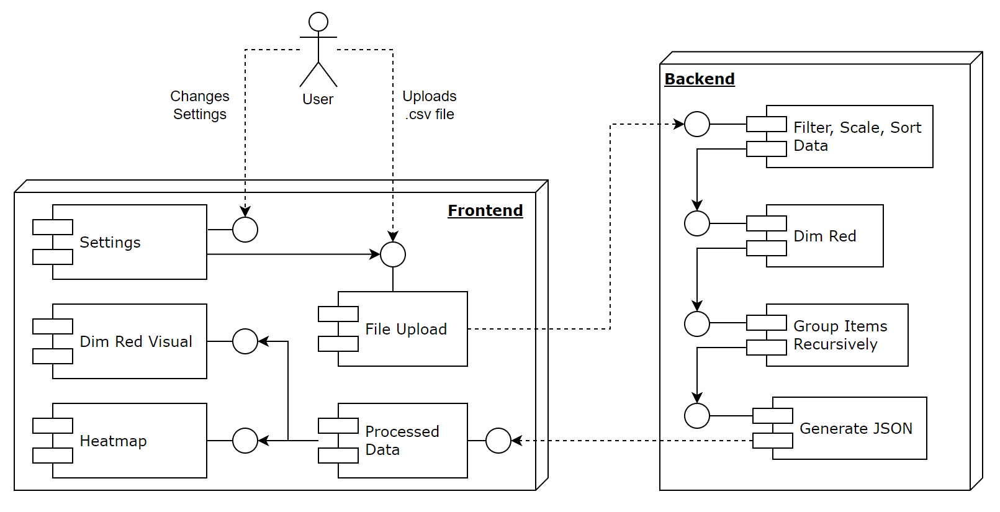

# Interactive Hierarchically Expandable Cluster Heatmap

## About

The Interactive Hierarchically Expandable Cluster Heatmap (IHECH) is a combination of a heatmap and a dimensionality reduction visual which aims to support users in their explorative data analysis of large volumes of hierarchical multi dimensional data.  
The IHECH specifically allows for the identification of clusters, outliers, the comparison of items across attributes on different granularity levels and the comparison of attributes across items of different granularity levels.

The IHECH was developed as part of the Bachelor Thesis of Jonas Blum (07.02.2024 - 07.08.2024) at the University of Zürich. The project was supervised by Michael Blum and Prof. Dr. Jürgen Bernard.

## Directories

| Directory  | Purpose                                                                                                              |
| ---------- | -------------------------------------------------------------------------------------------------------------------- |
| `backend`  | Contains the Flask Server backend                                                                                    |
| `frontend` | Contains the Vue.js frontend                                                                                         |
| `data`     | Contains sample data files, performance test results and preprocessing scripts for the creation of sample data files |

## Running App Locally

### Backend

1. `cd backend`
2. `source projectenv/bin/activate` (after `python -m venv projectenv`, `source projectenv/bin/activate` and `pip install -r requirements.txt`)
3. `flask run --debug`

### Frontend

1. `cd frontend`
2. `pnpm dev` (after `pnpm install`)
3. Visit http://localhost:5173

## Running App with Docker (Locally or on the Cloud)

1.  Optional (not needed to run locally): Set the `VITE_API_URL` equal to the backend URL in an environment file (.env)
2.  Run `docker-compose up --build` to start the frontend and backend
3.  Visit http://localhost:5173

## Component Diagram

